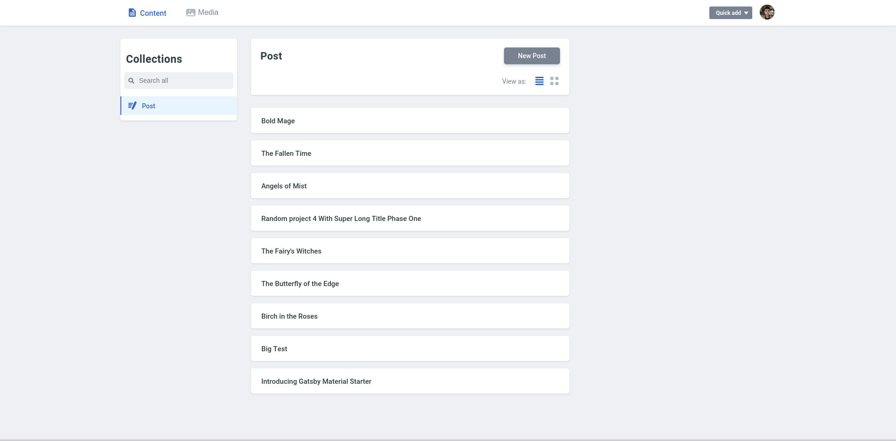
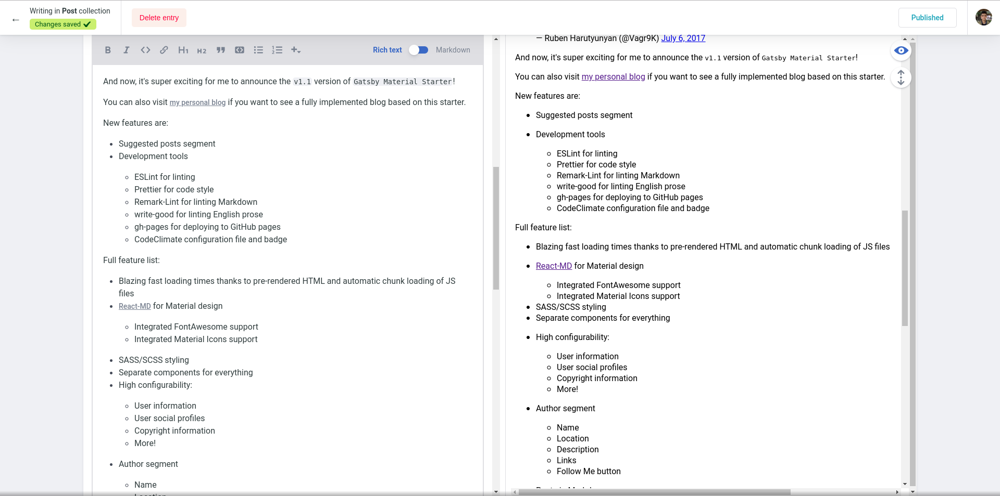

[](https://codeclimate.com/github/Vagr9K/gatsby-material-starter)
[](https://codeclimate.com/github/Vagr9K/gatsby-material-starter)
[](https://www.codacy.com/app/Vagr9K/gatsby-material-starter?utm_source=github.com&utm_medium=referral&utm_content=Vagr9K/gatsby-material-starter&utm_campaign=Badge_Grade)

<div align="center">
    
</div>

# Gatsby Material Starter

A blog starter with Material design in mind for [Gatsby](https://github.com/gatsbyjs/gatsby/).

[Demo website.](https://vagr9k.github.io/gatsby-material-starter/)


## GatsbyJS V2

This starter is based on GatsbyJS V2, which brings progressive web app features such as automatic code and data splitting (by route), prefetching, with service worker/offline-first support and PRPL pattern.

More information in the [announcement](https://www.gatsbyjs.org/blog/2018-09-17-gatsby-v2/).

NOTE: You can access the v1 version of the starter via the [`v1` branch](https://github.com/Vagr9K/gatsby-material-starter/tree/v1).

## Features

- Blazing fast loading times thanks to pre-rendered HTML and automatic chunk loading of JS files
- [React-MD](https://github.com/mlaursen/react-md) for Material design
  - Integrated FontAwesome support
  - Integrated Material Icons support
- SASS/SCSS styling
- [NetlifyCMS](https://www.netlifycms.org/docs/intro/) support for creating/editing posts via admin panel
- Separate components for everything
- High configurability:
  - User information
  - User social profiles
  - Copyright information
  - More!
- Author segment
  - Name
  - Location
  - Description
  - Links
  - Follow Me button
- Posts in Markdown
  - Code syntax highlighting
  - Embedded YouTube videos
  - Embedded Tweets
- Tags
  - Separate page for posts under each tag
- Categories
  - Separate page for posts under each category
- Suggested posts segment
- Disqus support
  - Notifications about new disqus comments
- Responsive design
  - On mobile, Disqus is loaded only after expanding comments for better performance
- Social features
  - Twitter tweet button
  - Facebook share/share count
  - Reddit share/share count
  - Google+ share button
  - LinkedIn share button
  - Telegram share button
- SEO
  - Sitemap generation
  - robots.txt
  - General description tags
  - Schema.org JSONLD (Google Rich Snippets)
  - OpenGraph Tags (Facebook/Google+/Pinterest)
  - Twitter Tags (Twitter Cards)
- RSS feeds
- Loading progress for slow networks
- Offline support
- Web App Manifest support
- Automatic image transformation and size optimization
- Netlify deploy configuration
- Google Analytics support
- Development tools
  - ESLint for linting
  - Prettier for code style
  - Remark-Lint for linting Markdown
  - write-good for linting English prose
  - gh-pages for deploying to GitHub pages
  - CodeClimate configuration file and badge

NOTE: Take a look at [gatsby-advanced-starter](https://github.com/Vagr9K/gatsby-advanced-starter) if you prefer building UI from scratch and/or only interested in fundamental features.

You can also visit [my personal blog](https://vagr9k.me) if you want to see a fully implemented blog based on this starter.


Showcase of NetlifyCMS:




## Getting Started

Install this starter (assuming [Gatsby](https://github.com/gatsbyjs/gatsby/) is installed and updated) by running from your CLI:

```sh
gatsby new YourProjectName https://github.com/Vagr9K/gatsby-material-starter
npm install # or yarn install
npm run develop # or gatsby develop
```

Or you can fork the project, make your changes there and merge new features when needed.

Alternatively:

```sh
git clone https://github.com/Vagr9K/gatsby-material-starter YourProjectName # Clone the project
cd YourProjectname
rm -rf .git # So you can have your own changes stored in VCS.
npm install # or yarn install
npm run develop # or gatsby develop
```

## Configuration

Edit the export object in `data/SiteConfig`:

```js
module.exports = {
  siteTitle: "Gatsby Material Starter", // Site title.
  siteTitleShort: "GM Starter", // Short site title for homescreen (PWA). Preferably should be under 12 characters to prevent truncation.
  siteTitleAlt: "GatsbyJS Material Starter", // Alternative site title for SEO.
  siteLogo: "/logos/logo-1024.png", // Logo used for SEO and manifest.
  siteUrl: "https://vagr9k.github.io", // Domain of your website without pathPrefix.
  pathPrefix: "/gatsby-material-starter", // Prefixes all links. For cases when deployed to example.github.io/gatsby-material-starter/.
  fixedFooter: false, // Whether the footer component is fixed, i.e. always visible
  siteDescription: "A GatsbyJS stater with Material design in mind.", // Website description used for RSS feeds/meta description tag.
  siteRss: "/rss.xml", // Path to the RSS file.
  siteFBAppID: "1825356251115265", // FB Application ID for using app insights
  siteGATrackingID: "UA-47311644-4", // Tracking code ID for google analytics.
  disqusShortname: "https-vagr9k-github-io-gatsby-material-starter", // Disqus shortname.
  dateFromFormat: "YYYY-MM-DD", // Date format used in the frontmatter.
  dateFormat: "DD/MM/YYYY", // Date format for display.
  userName: "Material User", // Username to display in the author segment.
  userTwitter: "", // Optionally renders "Follow Me" in the UserInfo segment.
  userLocation: "North Pole, Earth", // User location to display in the author segment.
  userAvatar: "https://api.adorable.io/avatars/150/test.png", // User avatar to display in the author segment.
  userDescription:
    "Yeah, I like animals better than people sometimes... Especially dogs. Dogs are the best. Every time you come home, they act like they haven't seen you in a year. And the good thing about dogs... is they got different dogs for different people.", // User description to display in the author segment.
  // Links to social profiles/projects you want to display in the author segment/navigation bar.
  userLinks: [
    {
      label: "GitHub",
      url: "https://github.com/Vagr9K/gatsby-material-starter",
      iconClassName: "fa fa-github"
    },
    {
      label: "Twitter",
      url: "https://twitter.com/Vagr9K",
      iconClassName: "fa fa-twitter"
    },
    {
      label: "Email",
      url: "mailto:vagr9k@gmail.com",
      iconClassName: "fa fa-envelope"
    }
  ],
  copyright: "Copyright © 2019. Material User" // Copyright string for the footer of the website and RSS feed.
};
```

You can also optionally set `pathPrefix`:

```js
module.exports = {
  // Note: it must *not* have a trailing slash.
  pathPrefix: "/gatsby-material-starter" // Prefixes all links. For cases when deployed to example.github.io/gatsby-material-starter/.
};
```

NOTE: `user*`, `disqusShortname` and `copyright` are optional and won't render if omitted.

WARNING: Make sure to edit `static/robots.txt` to include your domain for the sitemap!

## NetlifyCMS

First of all, make sure to edit `static/admin/config.yml` and add your [GitHub/GitLab/NetlifyId credentials](https://www.netlifycms.org/docs/authentication-backends/):

```yml
backend:
  name: github # Refer to https://www.netlifycms.org/docs/authentication-backends/ for auth backend list and instructions
  branch: master # Branch to update
  repo: vagr9k/gatsby-material-starter # Repo for pushing new commits. Make sure to replace with your repo!
```

You can visit `/admin/` after and will be greeted by a login dialog (depending on the auth provider you ave chosen above).

For NetlifyCMS specific issues visit the [official documentation](https://www.netlifycms.org/docs/intro/).

## Theming

Edit `src/layout/theme.scss` to suit your needs.
You can use [Material color palette](https://react-md.mlaursen.com/customization/colors) provided by React-MD.

```css
@import "~react-md/src/scss/react-md";
$md-primary-color: $md-grey-400;
$md-secondary-color: $md-red-800;
$md-tertiary-color: $md-grey-300;
```

# Author

Ruben Harutyunyan ([@Vagr9K](https://twitter.com/Vagr9K))
