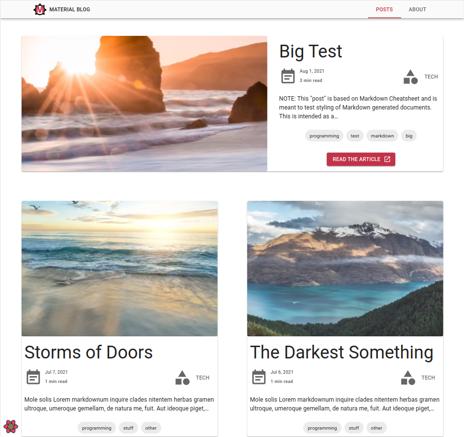

<div align="center" style="margin-bottom:30px">
    <a href='https://github.com/vagr9k/gatsby-material-starter/blob/master/LICENSE'>
    
    </a>
    <a href='https://github.com/vagr9k/gatsby-material-starter'>
    
    </a>
        <a href='https://github.com/vagr9k/gatsby-material-starter/stargazers'>
    
    </a>
        <a href="https://twitter.com/intent/tweet?text=A%20cool%20%40gatsbyjs%20starter%3A&url=https%3A%2F%2Fgithub.com%2FVagr9K%2Fgatsby-material-starter">
    
    </a>
</div>

<div align="center"  style="margin-bottom:30px">
    
</div>
<div align="center"  style="margin-bottom:30px">

<a href='https://coveralls.io/github/Vagr9K/gatsby-material-starter?branch=master'></a>
</a>
</div>

# Gatsby Theme Material

[`gatsby-theme-material`](https://www.npmjs.com/package/gatsby-theme-material) is a [Material Design](https://material.io/design) oriented blog theme for [GatsbyJS](https://github.com/gatsbyjs/gatsby/) equipped with advanced features such as SEO, image optimization, PWA capabilities and infinite scrolling feeds.

The theme uses [`gatsby-theme-advanced`](https://www.npmjs.com/package/gatsby-theme-advanced) under the hood.

## Previews



[Material Demo](https://gatsby-theme-material.netlify.app/).

Visit [`gatsby-theme-material`](https://github.com/Vagr9K/gatsby-material-starter/tree/master/themes/material) for details regarding on how it was built using [`gatsby-theme-advanced`](https://www.npmjs.com/package/gatsby-theme-advanced).

## Features

- Gatsby v4 support
- First class TypeScript support (for query data and components exposed by the theme)
- [Material UI V5](https://material-ui.com/) components
- [Emotion](https://emotion.sh/docs/introduction) used for styling
- Posts in MDX
  - Code syntax highlighting
  - Embed videos
  - Embed iframes
- Infinite Scrolling
- React Query for client side API calls
- Tags
  - Separate page for posts under each tag
- Categories
  - Separate page for posts under each category
- Social features
  - Twitter tweet button
  - Facebook share/share count
  - Reddit share/share count
  - LinkedIn share button
- Author section
- Related posts computation and display based on category/tag match ranking
- [Disqus](https://disqus.com/) support via [`gatsby-theme-advanced`](https://www.npmjs.com/package/gatsby-theme-advanced)
- [gatsby-plugin-image](https://www.gatsbyjs.com/plugins/gatsby-plugin-image/) for optimized image generation
- Inline SVG imports
- High configurability
- Separate components for everything:
  - Gatsby Link utilities
  - SEO
  - Disqus
- PWA features
  - Offline support
  - Web App Manifest support
  - Loading progress for slow networks
- SEO
  - [Google gtag.js](https://developers.google.com/gtagjs/) support
  - Sitemap generation
  - General description tags
  - [Google Structured Data](https://developers.google.com/search/docs/advanced/structured-data/intro-structured-data)
  - [OpenGraph Tags (Facebook/Google+/Pinterest)](https://ogp.me/)
  - [Twitter Tags (Twitter Cards)](https://developer.twitter.com/en/docs/tweets/optimize-with-cards/overview/markup)
- RSS feeds

## Usage

Install the theme via:

```sh
npm install gatsby-theme-material
```

or

```sh
yarn add gatsby-theme-material
```

Take a look at [`Gatsby Material Starter`](https://github.com/Vagr9K/gatsby-material-starter) which can help you to kickstart your development process.

To configure the theme, consult the [Configuration](#configuration) section.

Make sure you are familiar with [GatsbyJS](https://github.com/gatsbyjs/gatsby/) documentation for themes, in particular:

- [What Are Gatsby Themes?](https://www.gatsbyjs.com/docs/themes/what-are-gatsby-themes/)
- [Using a Gatsby Theme](https://www.gatsbyjs.com/docs/how-to/plugins-and-themes/using-a-gatsby-theme/)
- [Using Multiple Gatsby Themes](https://www.gatsbyjs.com/docs/themes/using-multiple-gatsby-themes/) for combining this theme with others
- [Shadowing in Gatsby Themes](https://www.gatsbyjs.com/docs/how-to/plugins-and-themes/shadowing/) for customizing this theme

## Configuration

To configure the theme edit your `gatsby-config.js`:

```js
module.exports = {
  plugins: [
    {
      resolve: `gatsby-theme-material`,
      options: {
        basePath: `/blog`,
      },
    },
  ],
};
```

Available options are:

```ts
const config: SiteConfig = {
  // Website configuration
  website: {
    title: "Gatsby Material Starter", // Homepage title
    titleShort: "Material Blog", // Short site title for homescreen (PWA). Preferably should be under 12 characters to prevent truncation
    name: "Gatsby Material Starter", // Website name used for homescreen (PWA) and SEO
    description: "A GatsbyJS starter equipped with material design.", // Website description used for RSS feeds/meta description tag
    language: "en", // Sets the global HTML lang attribute
    logoUrl: "/logos/logo-1024.png", // Logo used for SEO
    fbAppId: "APP_ID", // FB Application ID for using app insights
    twitterName: "Vagr9K", // Twitter handle of the website
    url: "https://gatsby-theme-material.netlify.app", // Domain of your website without the pathPrefix
    rss: "/rss.xml", // Path to the RSS file
    rssTitle: "Gatsby Material Starter RSS Feed", // Title of the RSS feed

    googleAnalyticsId: "UA-VALIDID", // GA tracking ID
    copyright: "© Copyright 2021 | Advanced User", // Copyright string for the footer of the website and RSS feed.

    themeColor: "#D83850", // Used for setting manifest and progress theme colors.
    backgroundColor: "#F7F7F7", // Used for setting manifest background color.
  },

  // User configuration
  user: {
    id: "MaterialUser", // Unique identifier of the user on the website. Used for OpenGraph SEO tags
    firstName: "Material", // Used for SEO
    lastName: "User", // Used for SEO
    twitterName: "Vagr9K", // Twitter username used for SEO
    linkedIn: "your-linkedin", // Used for contact information
    github: "vagr9k", // Used for contact information
    email: "MaterialUser@example.com", // Used for contact information and displayed in the RSS feed
    location: "User Location", // User location used for SEO
    about: "A full-stack web developer looking for a challenge!", // User information used for the author section
    avatar: "https://i.pravatar.cc/300", // User avatar used for the author section
  },

  // Organization information used for SEO
  organization: {
    name: "Organization Name",
    description: "Organization description",
    logoUrl: "/logos/logo-512.png",
    url: "https://gatsby-theme-material.netlify.app", // URL of the organization website
  },

  // Gatsby Configuration
  pathPrefix: "/", // Prefixes all links. For cases when deployed to example.github.io/gatsby-advanced-starter/.

  contentDir: undefined, // Directory for MDX posts. Defaults to "content".
  assetDir: undefined, // Asset directory. Defaults to "static".

  embeddedImageWidth: 768, // MDX embedded image width. Used by gatsby-plugin-image for optimization
  embeddedVideoWidth: 920, // MDX embedded video width in pixels

  iconPath: undefined, // Icon used for manifest icon creation.
  iconList: [], // Icons used for the web manifest. Can be used to override iconPath for a more pixel perfect control.
  iconCachePaths: undefined, // Glob pattern path for the icons to be cached by the gatsby-plugin-offline

  basePath: undefined, // Base path for mounting pages. Allows for multiple themes to be used in a single website.
};
```

## Demo

[Source Code](https://github.com/Vagr9K/gatsby-material-starter/tree/master/examples/material-demo)

[Live Preview](https://gatsby-theme-material.netlify.app)

# Author

Ruben Harutyunyan ([@Vagr9K](https://twitter.com/Vagr9K))
